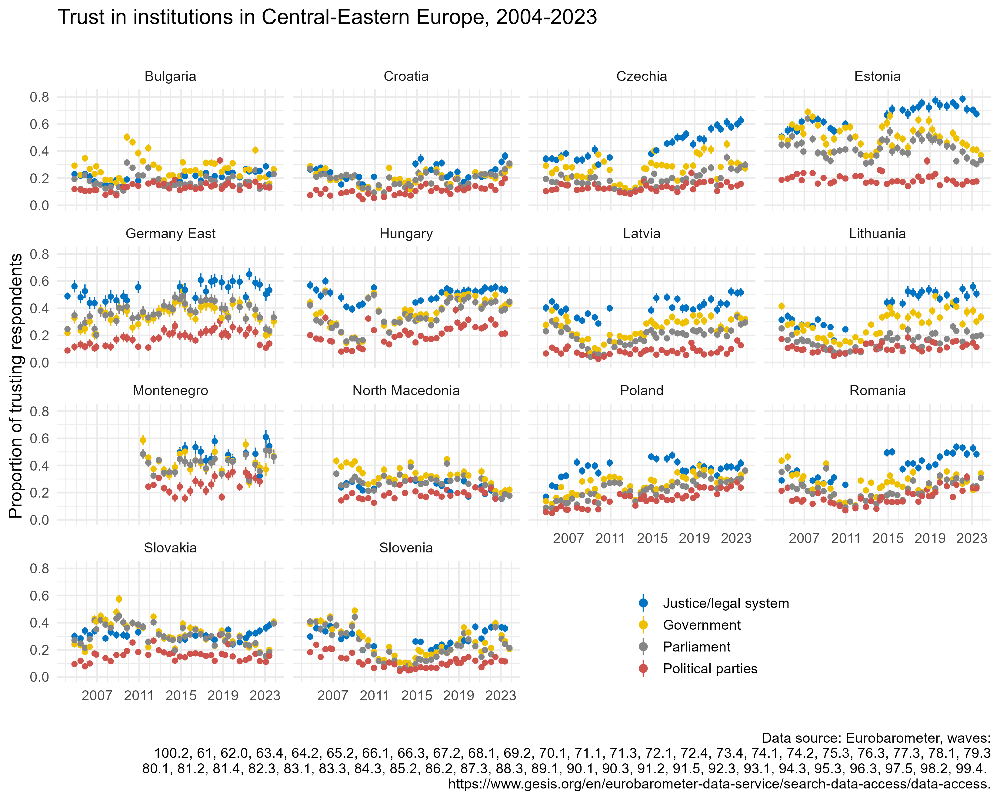
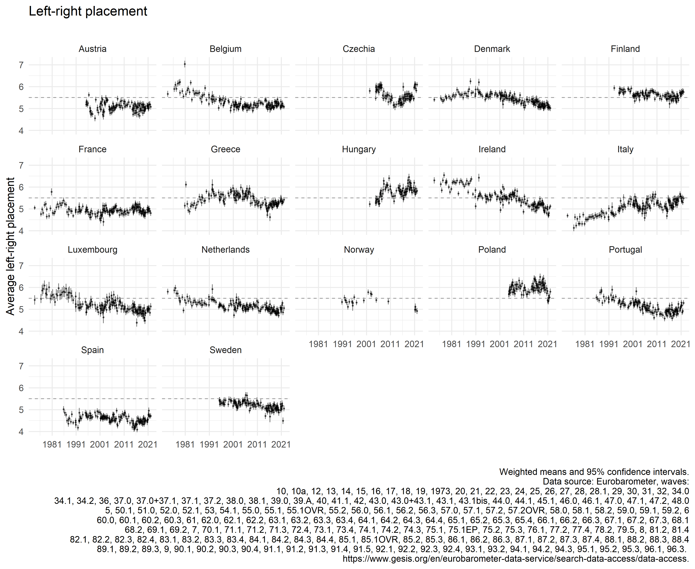

<!-- badges: start -->

<!-- badges: end -->

## Harmonization toolbox

Resources for secondary analysis of data from cross-national survey projects, including ex-post survey data harmonization.

This work is funded by the National Science Centre under grant number 2019/32/C/HS6/00421.

### Trust in institutions in Central-Eastern Europe, 2004-

Data from the [Eurobarometer](https://www.gesis.org/en/eurobarometer-data-service/search-data-access/data-access)

### Left-right self-placement in countries included in the Eurobarometer prior to 2004

Data from the [Eurobarometer](https://www.gesis.org/en/eurobarometer-data-service/search-data-access/data-access)

