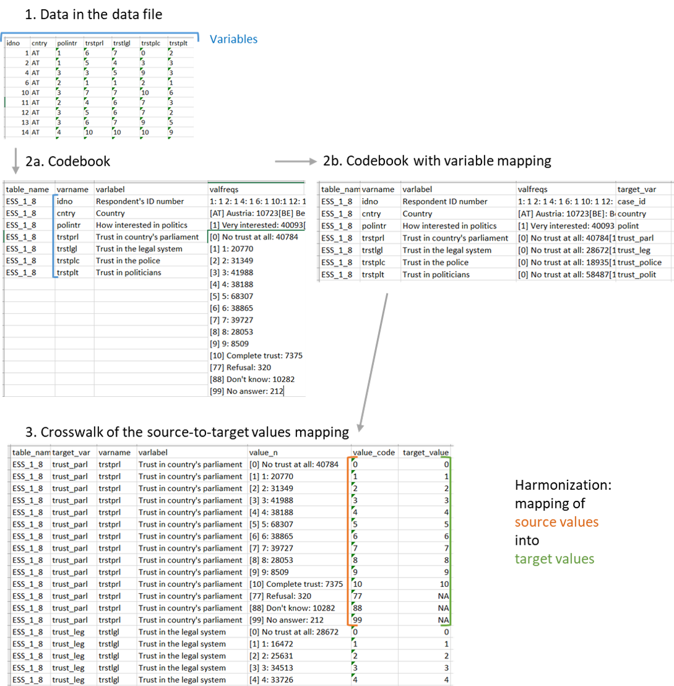

```{r setup, include=FALSE}
knitr::opts_chunk$set(cache = FALSE)
# Use chache = TRUE if you want to speed up compilation

# A function to allow for showing some of the inline code
rinline <- function(code){
  html <- '<code  class="r">``` `r CODE` ```</code>'
  sub("CODE", code, html)
}

# floating figures
knitr::opts_chunk$set(fig.pos = 'H')

# code chunk font size
def.chunk.hook  <- knitr::knit_hooks$get("chunk")
knitr::knit_hooks$set(chunk = function(x, options) {
  x <- def.chunk.hook(x, options)
  ifelse(options$size != "normalsize", paste0("\\", options$size,"\n\n", x, "\n\n \\normalsize"), x)
})
```

\clearpage

\renewcommand{\baselinestretch}{0.5}\normalsize
\tableofcontents
\renewcommand{\baselinestretch}{1.5}\normalsize

\clearpage

```{r packages, warning=FALSE, message=FALSE, echo = FALSE}
library(tidyverse) # data cleaning and reshaping
library(haven) # for importing spss files
library(labelled) # for dealing with labelled data
library(countrycode) # converting country codes to names
library(ggplot2) # for plotting
library(rio) # for importing and exporting data
library(knitr) # for making pretty tables
library(kableExtra) # for making prettier tables
```

\parindent 0.5in

# Introduction

International multi-wave survey projects are a major advancement in the social science infrastructure for cross-national research, yet their country and time coverage remains necessarily limited by funding availability, organizational conditions, PIs' interests, and other factors. Ex-post harmonization of survey data promises to overcome these limitations to create larger data sets with almost global coverage. At the same time, ex-post harmonization can create country time series necessary for longitudinal analyses, which enables stronger tests of theoretical mechanisms than cross-country comparisons. Thus, harmonization of existing data in order to maximally exploit their potential for research is one of the major challenges in empirical social science research. While the promises of new research opportunities are attractive to many, the associated challenges are multi-faceted - including technical, logistical, methodological, and substantive - and not yet well understood. This paper addresses one of these challenges, concerning the organization and documentation of the ex-post survey data harmonization process in a way that enables reproducibility of all data processing steps, as well as facilitates knowledge exchange.

The number of publications relying on combined data from different cross-national survey projects is increasing. These range from small projects where the harmonized data set is created for the purposes of a single publication or dissertation [e.g., @Christmann2018; @Christmann2018a; @Mauk2019] to large initiatives performing ex-post survey data harmonization not - or not only - for own substantive research, but in order to improve the social science research infrastructure [@Bekkers2015; @Klassen2018; @Slomczynski2018]. Correspondingly, the effort invested in the creation and sharing of the documentation of the harmonization process is characterized by substantial variation. 

The diversity of approaches to documenting the harmonization process reflects the general lack of clear and respected standards for computational reproducibility, i.e. the ability to re-create the results of published research using materials - data and code - provided by the authors of the original study, even if it is recognized that the value of published research largely depends on its reproducilibity [@Buckheit1995; @Munafo2017]. In addition to data and code, researchers are starting to recognize the role of the programming environment for computational reproducibility.

In this paper I describe a procedure and a set of simple tools for the exploration, recoding, and documentation of harmonization of survey data, relying on crosswalks for mapping one coding scheme onto another, which allow full computational reproducibility. The described approach includes automated steps that ensure efficiency of data processing, with human decision-making to integrate methodological expertise and domain knowledge, and enable flexibility necessary in dealing with the variation and diverse standards observed in survey data sets. The product of the harmonization process - apart from the harmonized dataset itself - is its documentation in form of crosswalk tables that map (1) source variables to target variables and (2) source values to target values. The readability of crosswalks enables the verification and reproduction of the harmonization process. 

The example presented in this paper uses the programming language R and spreadsheets - both common software among social scientists. The general framework combining recoding syntax and spreadsheets is software-agnostic and can be used with any programming language. Survey variables on trust in institutions from three cross-national survey projects - the European Social Survey [@ESS2018], the European Values Study [@EVS2015; @EVS2018], the European Quality of Life Survey [@EQLS2018] - serve as an illustration of the proposed workflow.

This work builds on the experiences of five inter-related projects: (1) the *Democratic Values and Protest Behavior: Data Harmonization, Measurement Comparability, and Multi-Level Modeling* project funded by the (Polish) National Science Centre (2012/06/M/HS6/00322, 2013-2016), its continuation *Survey Data Recycling: New Analytic Framework, Integrated Database, and Tools for Cross-national Social, Behavioral and Economic Research* funded by the U.S. National Science Foundation (2017-2021, PTE Federal award 1738502), (3) *New Approach to Analyses of the Relationship between Democracy and Trust: Comparing European Countries Using Quantitative and Qualitative Methodology* funded by the (Polish) National Science Centre (2012/05/N/HS6/03886, 2013-2015), (4) *Stratified Modernity, Trust in State Institutions and Democratic Change in Cross-national Perspective: Using Harmonized Survey Data from 116 Countries* project supported by the Silverman Research Support Award from the Department of Sociology, The Ohio State University (2017), and (5) *Effects of Status Inconsistency on Political Values, Attitudes and Behavior: A Cross-national Analysis with Survey Data Harmonized Ex-post*, funded by the Institute of Philosophy and Sociology, Polish Academy of Science (2017/S/05, 2018). 

The described procedures are substantially simplified compared to those implemented in the aforementioned projects in that they are limited to situations of 1:1 mapping, while other cases, such as combining two source variables into one target variable, would require other treatment. The tools were developed in the spirit of accessibility and reproducibility. Altogether, the workflow described in this paper is sufficiently simple that it can be successfully implemented by a single person or a small team of programming non-specialists, and powerful enough that it can handle large amounts of data and harmonization situations of moderate complexity, with highly complex cases possible to accomodate after some modifications. 

# What is ex-post survey data harmonization?

Ex-post (or retrospective) data harmonization refers to procedures applied to already collected data to improve the comparability and inferential equivalence of measures collected by different studies [@Fortier2017a]. In the case of ex-post survey data harmonization, the procedures are applied to survey data sets that were not intended for joint analysis, in order to integrate them into a single data set that can be meaningfully employed in substantive analyses. The harmonization process is simultaneously theory-informed and data-driven. Theories provide the concepts to be measured, but data availability to a large extent determines what ends up being measured and how. The following steps can be distinguished [cf. @Granda2016; @Wolf2016; @Fortier2017a; @Slomczynski2018; @Kolczynska2019]:

(1)	concept definition: 
    a.	defining the concept of interest guided by the theoretical framework and hypotheses; 
    b.	based on this definition, developing a preliminary coding scheme or choosing a coding scale for the harmonized (target) variable;
(2)	data preparation: 
    a.	gathering available surveys (data and documentation) that meet the requirements regarding the topics, target population and representativeness, and potentially others;
    b.	exploring the methodological variation they represent with regard to the design of the survey items of interest and the overall survey process; 
    c.	describing surveys in terms of methodology, including quality (and potentially exclude some surveys on this basis), and constructing survey quality indicators;
    d.	identifying relevant items in the gathered surveys that correspond to the target concept(s);
    e.	describing the methodological variation in the design of the selected survey items given the research of survey methodology and effects of item design on respondents’ answers (potentially exclude some items in this step);
    f.	identifying relevant dimensions of variation between the survey items to be captured by harmonization control variables;
    g.	adjusting the coding scheme or scale of the harmonized (target variable) based on the observed variation in the survey items;
(3)	harmonization: 
    a.	transforming source variables into the target variable(s) using the coding scheme;
    b.	constructing harmonization control variables to capture the properties of source variables that would be lost in the process of recoding;
(4)	checking the target variable for errors and documentation of the whole process.


## Ex-post survey data harmonization projects: A non-exhaustive review

Researchers increasingly combine data from multiple survey projects to fill in the gaps in geographical coverage, or to increase the presence of typically underrepresented countries, e.g. autocracies or countries from the Global South. @Dubrow2016 present a history of ex-post harmonization projects up to around 2015. This section briefly describes the approaches taken in a few most recent ex-post survey data harmonization projects. The number of publications relying on survey data harmonized ex-post is difficult to establish, because the name "ex-post survey data harmonization" is not commonly used term for the procedure in question. An alternative term, "integrative data analysis", proposed by Curran and Hussong [-@Curran2009], has not caught on either.

Based on a non-systematic review of ex-post survey data harmonization projects in the social sciences, two broad categories can be distinguished: small-scale projects where harmonization is performed for the purposes of a single paper or dissertation, and large-scale projects that enable multiple different analyses with the general aim of improving the social science research infrastructure. The two types of projects are described below, with attention paid to the type of materials related to data harmonization that were made available.


### Small-scale projects

I identified two small-scale projects, where ex-post survey data harmonization provided data for dissertation research. The first project [@Christmann2018; @Christmann2018a] harmonized data from several cross-national and national survey projects. The selection criterion for surveys was a particular design of the satisfaction with democracy question, which was the key variable in the analysis: only surveys with a four-point response scale were included. Replication materials that accompany the paper, available on Harvard's Dataverse, include the final harmonized data file and code for conducting the analysis, but no harmonization syntax[^1].

The second project deals with political trust and democratic values, and relies on data from six cross-national survey projects from a hundred countries with almost global coverage [@Mauk2019]. Replication materials, also stored on Dataverse, include a recoding syntax file with all the code necessary to create the harmonized variables used in subsequent analyses. The harmonized data set is not provided[^2].


### Infrastructure projects

There are at least three large-scale initiatives that perform ex-post survey data harmonization as their only or main task. The first one is the Democratic Values and Protest Behavior (DVPB) project [@Slomczynski2018, @Slomczynskietal2016, dataharmonization.org], which harmonized selected variables on political participation, political trust, and basic socio-demographics, from 22 major international survey projects between 1966 and 2013. The data are publicly available via Harvard's Dataverse[^3].
The project, now completed, used a suite of open-source tools for extracting source data, applying the harmonization procedures, and outputting data files in a format usable by social scientists. The programming environment is based on scripting tools, while data processing occurs in a MySQL database [@Powako2016]. The publicly available documentation consists of codebooks, recode syntax in SQL and lists of source variable names selected for harmonization from each data set [@Slomczynskietal2017]. The continuation of this initiative, the Survey Data Recycling project (dataharmonization.org), will extend the set of harmonized variable to also include social capital and well-being indicators, and update the data up to 2018.

The second project, Human Understanding Measured Across National Surveys (HUMANS, humansurveys.org) uses data from 19 cross-national and national survey projects, many of them the same as in DVPB, and harmonized variables on social trust, satisfaction with democracy, support for democracy, and perceived electoral integrity, as well as basic socio-demographics. The data are freely available on Dataverse[^4], and the codebook [@Klassen2018] provides the recodes from source to target coding schemes, names of source variables, and names of source data files, all in a PDF document.

The third initiative, the Harmonized Trust Database created by the Global Trust Research Consortium (GTRC, globaltrustresearch.wordpress.com), contains data from 79 national and cross-national survey projects, covering 155 countries since 1953. The project's Open Science Framework profile[^5] provides a PDF codebook [@Sandberg2018] with names of source projects, but without data file versions or source variable names. The harmonized data are not publicly available.

The three projects have very similar goals and scopes - in terms of the type of source data and the substantive interest in harmonizing particular variables - and yet, their approaches to documenting the harmonization, and the extent to which the harmonization is reproducible, are very different. While the DVPB project published voluminous documentation, in practice the exact replication of all harmonization procedures would most likely not be straightforward, despite the natural language-resembling nature of SQL, due to complications with re-creating the software environment. The HUMANS project published source and target variables, but the recoding schema is provided in a PDF document - not the most machine-readable format. GTRC provides neither the recode schemas nor the resulting data.  

The three large project described in this section have two other things in common. First, with the data and documentation made public it is not possible to extend the data set by adding extra harmonized target variables to the currently existing. The reason is that the two projects that provide the harmonized data - DVPB and HUMANS - do not include original respondent (case) IDs from the source data files (the HUMANS project does not provide any case IDs), so even though it is possible to construct additional variables separately, it is impossible to match them to the already harmonized data[^6]. Second, while all three are performing very similar and labor-intensive tasks with similar scopes, they have not (at the time of writing) communicated or shared experiences among each other, not to mention building on each other's work.

# What is reproducible?

A study can be called reproducible “if all of the code and data used to generate the numbers and figures in the paper are available and exactly produce the published results” [@Leek2017: 111]. "Guidelines for preparing replication files" by the *American Journal of Political Science* (AJPS) require that authors of all accepted articles provide replication materials and provide detailed instructions [@AJPS2016]. In articles that rely on secondary analyses, these replication materials must include "the relevant software commands for extracting the data from the separate sources, and for merging the separate subsets of data into the overall analysis dataset" (p. 4). Additionally, there should always be "a case identification variable that links observations in the analysis dataset to their original records in the source dataset. And, it is important to identify the specific version of the source dataset and the date that it is accessed in order to construct the analysis dataset." (p. 4)

# The proposed workflow

This section describes the harmonization steps and associated tools, to provide an overview of the whole process. In the proposed workflow, harmonization documentation - variable and values crosswalks - are a result of the harmonization process itself, not a separate product requiring additional attention.

Crosswalks are a commonly used approach for mapping of one schema onto the other. They are most useful when the source schema can be unambiguously translated into the target schema. In practice, this is rarely the case. In the process of survey data harmonization, in some cases the mapping is not straightforward, and decisions, sometimes arbitrary, need to be made. Like in other cases, also here, "[T]he key to a successful metadata crosswalk is intelligent flexibility" [@Hillmann2004, p. 91]. This is why mapping is performed manually. It is hard to compare the effort required to write a recode syntax *versus* that devoted to manual mapping, while the latter creates better opportunities for identifying errors or interesting cases worth in-depth examination.

The procedure starts with all the source data files downloaded to a single location, and their origin and versions noted. Next, each source data file is inspected to create the following technical variables: source case ID, target case ID (e.g., the row number in the data file), survey project, survey wave/round identifier, year of survey, country, and case weights.

In terms of data processing, the harmonization work involves working with data at different levels. For each of the following steps, a corresponding table is created on the basis of the source data, and exported to a spreadsheet program for manual mapping. The resulting crosswalks are used in the next step of harmonization and at the same time serve as documentation.

\parindent 0in
Step 1: Selection of source variables for harmonization.  
Step 2: Mapping source values to target values.  
Step 3: (Optional) Recording characteristics of source items.  

\parindent 0.5in

The first step is at the variable level, and involves identifying variables for harmonization in the source data files, and assigning a standardized target variable name to each source variable of interest. To do this, a table with a list and description of all source variables –- the *codebook* –- is created in the programming environment on the basis of metadata from the source data files, and includes variable names, labels, as well as values and value labels and their corresponding frequencies. The codebook is then exported to a spreadsheet program, where variable lables are filtered to identify candidates for source variables. In some cases, for example is variable labels are too short or otherwise uninformative - it is necessary to consult the original survey documentation. After all source variables corresponding to the concepts of interest -- in this case trust in institutions -- are identified via filter searches or otherwise, the table is imported back into the programming environment.

The second step is at the level of individual values of the chosen source variables, and requires mapping these source values onto a common coding scheme of the respective target variable. Subsets of source data files are selected that include only the variables tagged in Step 1. For those variables, a *cross-walk table* is created, i.e., a table similar to the codebook, but where each source value corresponds to one row. This table is then exported to a spreadsheet, where each source value is assigned a target value on the basis of the common coding scheme. This step also includes identifying missing value codes (such as negative numbers or multiples of 8 or 9) as missing. Next, the cross-walk table is imported back into the programming environment, where the source and target values for each source variable are mapped, resulting in a set of harmonized variables.

The third, optional, step is at the data file level, and refers to the coding of properties of the source variables that are worth preserving because of methodological reasons, such as the length or direction of the original response scales. Typically, these properties vary between, but not within, survey projects. For example, in the European Social Survey, questions about trust in institutions are accompanied by 11-point scales ranging from 0 (No trust at all) to 10 (Completely trust) [@ESS2016b]. 

```{r schema, fig.cap="Harmonization: Data flow schema.", out.width = "465px", echo = FALSE}

```


# Illustration: Trust in institutions

As an illustration I use items on trust in institutions in three main cross-national survey projects in Europe: the European Social Survey, the European Values Study, and the European Quality of Life Survey. The data are available from the project website [@ESS2018], the GESIS archive [@EVS2015; @EVS2018], and the UK Data Archive [@EQLS2018], respectively. All three projects conduct surveys in many European countries in each project wave, with samples intended as representative for entire adult populations of the respective country. Table \@ref(tab:project-table) presents basic information about these survey projects. Standardized documentation about the methodology employed in all projects has been put together by Piotr Jabkowski [-@Jabkowski2018].

Trust in political and other institutions is a common item in many cross-national surveys and appears in all waves of all three projects. Each project includes questions about trust in a different set of institutions. Further, while in all three projects questionnaires tend to be relatively stable from wave to wave, the sets of questions have seen some changes, in particular new items had been added, and not always a given item was asked in all countries in a given wave. Finally, in each project the design of the trust items is slightly different. Major differences include the length and direction of the response scale, while other differences -- response scale polarity or details of the question wording -- seem to be of lesser importance for the distribution of the answers [@KolczynskaSlomczynski2018].


```{r project-table, warning=FALSE, message=FALSE, echo = FALSE}
ESS <- c("European Social Survey (ESS)", "8", "1", "195", "2002-2017")
EQLS <- c("European Quality of Life Survey (EQLS)", "4", "1", "126", "2003-2016")
EVS <- c("European Values Study (EVS)", "5", "2", "140", "1981-2017")

rbind.data.frame(ESS, EQLS, EVS, stringsAsFactors=FALSE) %>%
  kable(col.names = c("Project name", "waves", "data files", 
                      "surveys", "Years"),
        align = c("l", rep("c", 4)),
        caption="Description of the survey projects used in the analysis.",
        format = "latex", booktabs = TRUE) %>%
  kable_styling(latex_options = c("striped", "hold_position"),
                full_width = T, 
                position = "left", font_size = 11) %>%
  column_spec(1, width = "20em") %>%
  column_spec(2:4, width = "4em") %>%
  add_header_above(c(" ", "Number of" = 3, " "))
```


## Step 0: Preparation and coding of technical variables

In the proposed schema, survey projects correspond to the organizational structures that publish data under the same brand, such as the European Values Study or the European Social Survey. The amount of coordination and centralization of decision-making about the survey process varies greatly among projects. 

All projects used here have multiple waves of data collection. Each wave consists of national surveys, identified as a survey carried out in a given country and project wave. National surveys are identified as *project\*wave\*country*, which typically is equivalent to *project\*year\*country*. Most often the national survey level is equivalent to the sample level, i.e., a national survey is administered to respondents who are part of the same sample, with the sample representative for the entire population of a given country [^7]. 

In the preparatory step, all data files are loaded into the R workspace. The SPSS file format is preferred, since it comes with variable and value labels that are easy to extract. Next, the *technical variables* are identified, corresponding to the survey wave (if applicable), country, year, case (respondent) IDs, and weighting factors. A separate variable corresponds to the name of the source table.

## Step 1: Selection of source variables for harmonization

The first step in the harmonization process is the selection of source variables corresponding to the target concepts of interest. The target concepts in this case include trust in different institutions, as many as there are available in the source data, basic sociodemographics (age, gender, education, income) and selected covariates (satisfaction with life and social trust).

To map source variables to target variable names, the *codebook* is created with a list of source variables in each data set. This list should include the source variable name, and -- since variable names tend to by cryptic -- also the source variable label. The frequency distribution of values, as well as value labels, provide additional information in case the variable label is not informative, e.g., to distinguish age in years from age in categories.

The codebook can be generated from labelled data, such as those in SPSS format. In R, such a codebook can be created with the package `labelled` [@labelled]. The R code for creating the codebook is presented in [Appendix 1](#appendix1).

The codebook is then exported into a spreadsheet program (e.g., with the `rio` package, @rio), where variable labels can be browsed and filtered to select the source variables of interest, and assign appropriate target variable names. The target variable names will be `trust_*`, where `*` is the short version of the institution name. If necessary, notes or comments on particular decisions can be written in a separate column of the spreadsheet. Notes may document decisions to treat questions about slightly different wording as corresponding to the same target variable (e.g., trust in the justice system vs. trust in the legal system), or add information from other sources, such as the original documentation of the source data.

Figure \@ref(fig:codebook) shows a snippet of the codebook created for ESS, EVS, and EQLS. The first column (`table_name`) corresponds to the name of the source table - one each for ESS and EQLS, and two separate tables for EVS/5 and EVS/1-4. The column `varname` contains the names of source variables, `varlabel` contains the variable labels, and `valfreqs` contains frequencies of all values with value labels provided. The column `target_var` is to be filled with names of target variables to which the selected source variables correspond. In the example shown in Figure \@ref(fig:codebook), the label `trust_parl` has been assigned to the variable on trust in parliament, the label `trust_police` to the variable on trust in the police, and so on. Filtering available in spreadsheet programs enables sorting and filtering through variables with keywords or other conditions. 

```{r codebook, fig.cap="Codebook represented in a spreadsheet program.", out.width = "465px", echo = FALSE}
knitr::include_graphics("../pictures/codebook_full.png")
```

## Step 2: Mapping source values to target values

In the second step, for the variables selected with the codebook, a *crosswalk* template is created, where each value of each variable is in a separate row. Again, the `labelled` package can be used to obtain the desired format, as shown in [Appendix 2](#appendix2).  

This manual mapping of source values to target values, while mundane, achieves two goals. First, it enables the identification of missing value codes in each variable separately. Missing value codes are not always consistent even across variables in the same data set, and mistakes in automated recoding of missing values have a potentially large impact on the resulting data. Additionally, researchers might want to treat different missing values differently depending on their research goals, i.e., considering the "don't know" category as a type of opinion (or rather lack thereof), and the "refusal" category as in fact missing.  

The second goal is a careful inspection of full labels of the source values, one by one, while consulting the textual survey documentation wherever necessary. The need to assign each target value a corresponding source value again protects from possible mistakes of automation, and is particularly useful in the case of categorical variables with limited standardization across waves and projects, such as education or size of town of residence. 

The snippet in Figure \@ref(fig:cwt) shows a fragment of the crosswalk for trust in the police in EVS/5, for which the source variable is called `v120`, realized values include negative values for different types of missing data, and values from 1 to 4 correspond to substantive answers. Corresponding target values would be added in the `target_value` column.

```{r cwt, fig.cap="Crosswalk.", out.width = "465px", echo = FALSE}
knitr::include_graphics("../pictures/cwt_full.png")
```

Once the value crosswalk table is ready, it is imported into the programming environment, and -- for each source variable separately -- source and target values are extracted as vectors and used in data transformation. The function `mapvalues` from the `plyr` package [@Wickham2011], which maps each value from the source variable vector onto a corresponding value from the target variable vectors, is particularly useful in this regard.

## Step 3: Recording characteristics of source items

Cross-national surveys differ in almost all imaginable aspects related to the methodology of the survey process, starting from questionnaire development and pretesting, through fieldwork procedures and response or realization rates, the design of individual survey items [@KolczynskaSlomczynski2018], to the quality of documentation [@Jabkowski2019; @KolczynskaSchoene2018], as well as processing errors [@Oleksiyenko2018] and the quality of survey weights [@Zielinski2018]. According to the literature on survey methodology, in particular in the Total Survey Error (TSE) paradigm, the comparability of surveys is reduced whenever the amounts of random and systematic error are different across surveys [@Smith2018]. The TSE framework currently counts 35 different sources of error, so the potential for deviations is large.

The amount and type (random or systematic) of each type of error in surveys is unknown (and for the most part unknowlable). One approach to dealing with the methodological variation of surveys comprising a single harmonized data set is to construct additional variables that capture selected properties of the source data or documentation in form of control variables. It is still not clear whether including these control variables in substantive analyses improves model estimates or not, and under which cirsumstances, but such methodological controls can at least be used in data exploration.

Item and other methodological properties can be recorded in a separate table, where the national survey (project\*wave\*country) is the unit of observation.


## Results: Availability of trust items

Altogether, in the three analyzed datasets, I identified trust items in 27 different institutions. The most common items are on trust in the legal system and in the police, available in 433 national surveys out of 461 surveys in total. The next item with regard to its availability in surveys is about trust in the national parliament (430 surveys), followed by trust in the United Nations (290) and trust in political parties (266). I is worth noting that I treated the European Union (118 surveys) and the European Parliament (195 surveys) as separate institutions. A different decision - combining both items into one target variable - would make it the fourth most popular turst item.

The availability of trust items across the three survey projects is presented in Figure \@ref(fig:trust-availability). The three most common items - trust in the police, the legal system, and the national parliament - are available in all three projects: in all national surveys in ESS and EVS, and in rounds 2-4 of EQLS. The trust in parliament item is additionally missing from three surveys in EVS/2 (Estonia, Latvia, and Lithuania surveyed in 1990).

Other items occur only in selected projects or project waves. For example, the item on trust in the social media was only added in EVS/5.

```{r trust-availability, warning = FALSE, message = FALSE, echo = FALSE, fig.pos="H",  fig.height = 5, fig.width = 7.5, fig.cap = "Availability of trust in institutions items in the European Social Survey/1-8, European Values Study/1-5, and the European Quality of Life Survey/1-5."}

cbPalette <- c("#999999", "#E69F00", "#56B4E9")

all_data <- import("../data/all_data.csv.gz")

all_data %>%
  group_by(t_project, t_round, t_country, t_year) %>%
  summarise_at(vars(starts_with("trust")), funs(weighted.mean(., w = t_weight, na.rm = TRUE))) %>%
  gather(variable, value, 5:30, na.rm = TRUE) %>%
  ungroup() %>%
  left_join(rio::import("../data/var_names_labels.csv")) %>% 
  group_by(label) %>%
  mutate(countn = n()) %>%
  count(t_project, label, countn) %>%
  ggplot(., aes(x = reorder(label, countn), y = n, fill = t_project)) + 
  geom_bar(stat = "identity") +
  theme_bw() +
  xlab("") +
  ylab("Number of surveys") +
  scale_fill_manual(name = "Project",
                    values = cbPalette[1:3]) +
  coord_flip()
```


# Limitations

The presented approach naturally has some limitations. Some of them are inherent to the tool used - the crosswalk. If the source and target schemas do not map onto each other very well, the need for the aforementioned "intelligent flexibility" [@Hillmann2004, p. 91] arises. At the same time, crosswalks enable mapping from a single scheme onto another single scheme. Some researchers might want to construct the target variable on the basis of two or more source variables or in a way requiring logical operations. For example, the target variable "membership in organizations" could be constructed with two source variables corresponding to membership in political organizations and membership in non-political organizations. Cases when two (or more) variables need to be combined into one target variable can be handled easily in the code, with the identification of missing values and perhaps preliminary recoding in the crosswalk. 

Another limitation deals with ex-post survey data harmonization in general. Each time a transformation of the source variable(s) is performed, the costs and benefits need to be considered. Since at least the 1940s it has been known that the design of the survey items influences the distribution of respodents' answers, and - consequently - of sample aggregates, such as means or proportions [@Cantril1944]. In the case of items that are designed as a scale to measure a latent trait, selecting some items of the scale, or changing their coding, may undermine the validity of the scale  [@Mustillo2018].

While the literature on the question and questionnaire design effects is rich and constantly growing, recommendations are typically formulated with regard to best practices in future data collection efforts, not from the point of view of procedures that improve the comparability of already existing data.


# Recommendations

The minimum for reproducibility of any secondary analysis or processing of survey data is the information about:    
1. the origin of the data files, their format, version, and information about how to obtain them;  
2. original data files;  
3. original data documentation, with their version and origin recorded;  
4. recoding syntax in a recognized language;  
5. instructions describing the procedures.  

Regarding point 1, it is possible that after some time the original data files will disappear from their original locations on project websites or in data archives. This is why storing the original data file (point 2) may turn out crucial for future reproducility of analyses. The original documentation (point 3) proves invaluable in cases when, for example, the original data set has suspcious value labels, or does not have value labels at all. Computer code (point 4) is necessary to reproduce all data transformations exactly as they were originally performed. Even having the code, sometimes additional instructions are necessary informing, for example, about the order of executing the code files (point 5).

It is possible that this "minimum package" will actually enable the reproduction of all procedures, but the odds are not favorable. The potential reasons are many, ranging from insufficient competence in the given programming language, to errors in the code, ambiguous instructions, lack of documentation, differences in the software or hardware environment, or the very existence of the source data in the version used. Creating reproducible documentation is hard, because missing even one of the necessary steps or components leads to the failure of the whole process. 

There are several ways of improving the reproducibility of data processing. The first one is automating all automatable data processing steps, including importing the data, cleaning, processing, and exporting. In all cases, but especially if not all data processing steps can be automated, the code should be annotated. Following @Liu2019, code documents should include information about the general purpose of the code segment, as well as a description of the input, the outputs, the type of machine used, and the expected runtime. All steps of manual processing should be documented, ideally in machine-readable form, with document versioning and visible corrections. The latter point is important to recostruct the decision changes, and in tracking down errors.

Chances for successful data processing reproduciblity increase if also the software environement is documented, i.e., versions of all software and packages or libraries that were used in data processing. Liu and Salganik [-@Liu2019] recommend the use of software containers (such as Docker) to standardize the software environment, and cloud computing (such as Amazon Web Services) to standardize the hardware, especially in computation-intensive analyses.  . Epskamp [-@Epskamp2019] proposes a list of general and specific recommendations for mitigating the risks stemming from software development and change. Marwick, Boettinger and Mullen [-@Marwick2017] offer suggestions for reproducible data analytic work in R using packages.

Reproduciblity of data processing in the long term benefits from the human-friendliness and universal format of the documentation files [@Hart2016]. In this case simpler is better, and chances are that text files will be usable "forever" but SPSS syntax files not necessarily. Hence, data processing syntax in other forms than just code -- such as crosswalks -- has a potential to be accessible more widely and for longer. The future will show which data formats will last [cf. @MuseumofObsoleteMedia2019], but it seems that long term readibility and access is more likely for non-proprietary formats that are open source, well documented, and widely used.

The choice of format does not free one from taking care of the file's contents. While spreadsheets seem to be straightforward tools for managing data, there are many mistakes than can be avoided when creating them, including in naming variables, formatting dates, or (avoiding) merging cells or empty cells [@Broman2018].

In the recent years there has been increasing awareness of the value and challenges of replicability and reproduciblity, both among researchers and educators. Reith, Paxton, and Hughes [-@Reith2016] offer recommendations for creating cross-national, logitudinal data sets, many of which also apply to harmonizing survey data. Project TIER (Teaching Integrity in Empirical Research) developed the Documenting Research in the Empirical Social Sciences (DRESS) protocol - a set of guidelines for documenting empirical research [@ProjectTIER2016]. 

It is worth noting that making any of the materials necessary for reproduction of results available "upon request" is not an effective policy. Analyzing 204 computational articles published in Science in 2011-2012, Stodden and colleagues [-@Stodden2018] were able to obtain materials for less than half of the articles, and to reproduce the results in just a quarter of them. As Gelman [-@Gelman2013] wrote, "it's too hard to ... obtain data for replication."


\clearpage

# Appendices

R code [@baser] to construct the codebook and the crosswalk, as well as to create the surveys list, are provided in Appendix [1](#appendix1), [2](#appendix2), and [3](#appendix3), respectively. Packages used include: `haven` for importing the data into R [@haven], `labelled` for dealing with labels [@labelled], and the `tidyverse` suite for data wrangling [@tidyverse].

## Appendix 1: Codebook from labelled data in R {#appendix1}

```{r app1-codebook, eval=FALSE, echo=TRUE, size = 'scriptsize'}
create_codebook <- function(data) {
  var_labels <- data.frame(cbind(names(var_label(data)), do.call(rbind, var_label(data)))) %>%
    rename(var_name = X1, var_label = X2)
  freqs <- lapply(data, function(x) { return(questionr::freq(x)) }) %>%
    keep(function(x) nrow(x) < 1000) %>%
    do.call(rbind, .) %>% 
    tibble::rownames_to_column(var = "var_name_value") %>%
    mutate(var_name = gsub("(.+?)(\\..*)", "\\1", var_name_value),
           value = gsub("^[^.]*.","",var_name_value)) %>%
    group_by(var_name) %>%
    mutate(npos = row_number(),
           value_n = paste(value, n, sep = ": ")) %>%
    select(var_name, value_n, npos) %>%
    spread(npos, value_n) %>%
    mutate_at(vars(-var_name), funs(ifelse(is.na(.), "", .))) %>%
    unite("val_freqs", c(2:ncol(.)), sep = "\n") %>%
    mutate(val_freqs = sub("\\s+$", "", val_freqs))
  full_join(var_labels, freqs, by = "var_name")
}
```

## Appendix 2: Values crosswalk {#appendix2}

```{r app2-cwt, eval=FALSE, echo=TRUE, size = 'scriptsize'}
create_cwt <- function(data) {
  var_labels <- data.frame(cbind(names(var_label(data)), do.call(rbind, var_label(data)))) %>%
    rename(var_name = X1, var_label = X2)
  freqs_cwt <- lapply(data, function(x) { return(questionr::freq(x)) }) %>%
    keep(function(x) nrow(x) < 1000) %>%
    do.call(rbind, .) %>% 
    tibble::rownames_to_column(var = "var_name_value") %>%
    mutate(var_name = gsub("(.+?)(\\..*)", "\\1", var_name_value),
           value = gsub("^[^.]*.","",var_name_value),
           value_code = sub(".*\\[(.+)\\].*", "\\1", var_name_value, perl = TRUE),
           value_code = ifelse(str_sub(var_name_value, -2, -1) == "NA", "NA", value_code),
           value_code = ifelse(gsub(" ", "", fixed = TRUE, var_name_value) == var_name_value, 
                               gsub("^[^.]*.","",var_name_value), value_code)) %>%
    group_by(var_name) %>%
    mutate(npos = row_number(),
           value_n = paste(value, n, sep = ": ")) %>%
    select(npos, var_name, value_n, value, value_code)
  full_join(var_labels, freqs_cwt, by = "var_name")
}
```

## Appendix 3: Metadata table {#appendix3}


```{r app3-survey-list, eval=FALSE, echo=TRUE, size = 'scriptsize'}

# This function can be run after the following variables in the source data have been constructed:
# t_project for the project abbreviation;
# t_round for the project round;
# t_country for the country code;
# t_year for the survey year.

create_surveys_list <- function(data_frame_vector) {
  surveys_list <- list()
  for (i in 1:length(data_frame_vector)) {
    surveys_list[[i]] <- eval(parse(text = data_frame_vector[i])) %>%
      mutate(t_survey = paste(t_project, t_round, t_country, sep = "")) %>%
      count(t_survey, t_year)
  }
  do.call(rbind, surveys_list)
}
surveys_list <- create_surveys_list(c("eqls_1_4", "evs_5", "evs_1_4", "ess_1_8"))
```

[^1]: Christmann, Pablo; Torcal, Mariano, 2017, "Replication Data for: The Effects of Government System Fractionalization on Satisfaction with Democracy", https://doi.org/10.7910/DVN/EU541C, Harvard Dataverse, V1.

[^2]: Mauk, Marlene, 2019, "Replication Data for: Disentangling an elusive relationship", https://doi.org/10.7910/DVN/IIVAJM, Harvard Dataverse, V1.

[^3]: The data and documentation from the Democratic Values and Protest Behavior (DVPB) project are available via Dataverse at https://doi.org/10.7910/DVN/VWGF5Q

[^4]: The data and documentation from the Human Understanding Measured Across National Surveys (HUMANS, humansurveys.org) projects are available at https://dataverse.harvard.edu/dataverse/humansurveys.

[^5]: The Harmonized Trust Database created by the Global Trust Research Consortium (GTRC) (globaltrustresearch.wordpress.com) makes the documentation available via OSF at https://osf.io/qfv76/

[^6]: The DVPB project found rare cases of duplicated respondent IDs in some of the harmonized surveys. Non-unique respondent IDs obviously compromise unambiguous matching of the harmonized and source data.

[^7]: In some cases, if more than one sample is drawn in one country for historical, administrative, or cultural reasons, e.g., in Germany (East and West Germany) or in Belgium (Wallonia and Flanders). These sub-national samples can be either treated as separate surveys, or combined into a single survey with appropriate weights. In the projects included in this analysis the problem of sub-national samples does not exist, but it is signaled for the sake of clarity.

# References

\renewcommand{\baselinestretch}{1}\normalsize
\parindent 0in
\leftskip 0.2in
\parindent -0.2in
